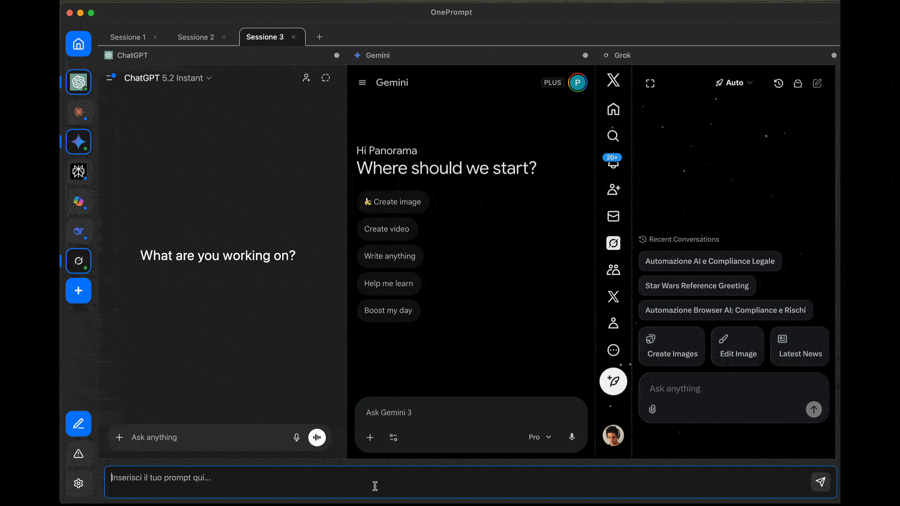

# OnePrompt

<div align="center">
  
</div>


[](https://buy.stripe.com/28E6oIcRUcc0cE48oO2wU04)

**An Electron desktop app to compare responses from multiple AI platforms simultaneously.**

<div align="center">
  
</div>

Tired of copy-pasting the same prompt into ChatGPT, Claude, Gemini, and Perplexity to compare responses? OnePrompt solves this: write your prompt once and automatically send it to all the AIs you want, getting multiple responses to compare side-by-side.

---

## ⚠️ Legal & Compliance Warning

**READ THIS BEFORE USING OR DOWNLOADING**

This application uses browser automation to interact with AI services. **This violates the Terms of Service of most platforms** and carries real risks:

### Risks
- 🚫 **Your AI accounts may be banned** (ChatGPT, Claude, Gemini, etc.)
- 📧 **The project may receive DMCA/takedown notices**
- ⚖️ **Commercial use could result in legal action**
- 🔒 **Your accounts may be suspended without warning**

### Why I Built It Anyway

This project exists because I needed a better way to compare AI responses for personal testing. Managing 4-5 browser tabs is inefficient, and official APIs are expensive for casual use.

**I acknowledge this violates ToS.** I built it as:
- ✅ A personal productivity tool
- ✅ An educational exploration of Electron webviews
- ✅ A demonstration of what's technically possible

**Use at your own risk.** By downloading or using OnePrompt, you accept full responsibility for any consequences.

### Recommended Use
- ✅ **Personal and educational use only**
- ✅ **Understand you may lose access to your AI accounts**
- ❌ **NOT for commercial distribution**
- ❌ **NOT for intensive/automated usage**
- ❌ **NOT if you depend on your AI accounts professionally**

---

## 🎯 The Problem It Solves

When working on something important, you want the best possible answers. Often this means:
1. Open ChatGPT → paste prompt → wait for response
2. Open Claude → paste same prompt → wait for response
3. Open Gemini → paste again → wait for response
4. Open Perplexity → ... and so on

**OnePrompt automates this workflow**: one prompt, all AIs, immediate responses to compare.

## Features

- 🚀 **One prompt for all AIs**: Write once, send everywhere
- 🎯 **Flexible selection**: Choose which AIs to use for each prompt
- 🔐 **Persistent sessions**: Keeps your logins active (like Franz and Rambox)
- 💻 **Cross-platform**: Available for macOS and Windows
- 🎨 **Clean interface**: Minimalist and intuitive design

## Supported AI Platforms

### Currently Working (with limitations)
- ChatGPT (OpenAI)
- Claude (Anthropic)
- Gemini (Google)
- Copilot (Microsoft)
- DeepSeek
- Grok (X)
- Perplexity

### Planned
- Mistral AI
- Phind
- Replit AI
- Bolt.new
- Lovable.dev

**Note**: Prompt injection and automation features are experimental and may not work consistently across all platforms.

## Installation

### Download Binaries (Recommended)

Download the latest version from the [Releases page](https://github.com/calabr93/one-prompt/releases):
- **macOS**: Download the `.dmg` or `.zip` file
- **Windows**: Download the `.exe` file

### Development

```bash
# Install dependencies
npm install

# Start in development mode
npm run dev
```

### Build

```bash
# Build for macOS
npm run build:mac

# Build for Windows
npm run build:win
```

## Releases & Updates

### Creating a New Release (for developers)

Releases are created automatically via GitHub Actions when you push a new tag:

```bash
# Create and push a version tag
git tag v1.0.0
git push origin v1.0.0
```

GitHub Actions will automatically compile the application for macOS and Windows and create a release with the binaries.

### How Updates Work (for users)

OnePrompt **automatically checks for updates** when you open the app:

1. **On app launch**, OnePrompt silently contacts the update server (takes ~1 second)
2. If a **new version is available**, a system notification appears
3. **Click "Install"** in the notification to download the update in the background
4. When download completes, **click "Restart"** to install and relaunch the app

**No manual downloads needed!** The app keeps itself up-to-date.

> **Note**: Currently, update notifications appear in the console (for v0.1.0). A visual in-app notification UI will be added in a future release.

**Privacy note**: Update checks are anonymous (see [Privacy & Data Collection](#-privacy--data-collection) section).

## How It Works

OnePrompt uses **Electron webviews** to embed various AI platforms directly in the app, keeping sessions active just like a dedicated multi-tab browser.

**Technical architecture**:
- Each AI runs in an isolated webview with persistent session
- Automatic prompt injection via preload scripts
- No external APIs required (works with your existing free accounts)

**Benefits**:
- ✅ **No additional costs**: No paid API keys needed
- ✅ **Full access**: All features of the web platforms
- ✅ **Persistent sessions**: Your logins stay active between sessions
- ✅ **Privacy**: Your prompts and AI responses never leave your device

## 🔒 Privacy

**OnePrompt respects your privacy.**

- ✅ **Minimal Analytics**: We use PostHog to track basic usage (app opens) to understand how many people use the app. This data is anonymous and helps us improve the project.
- ✅ **No Personal Data**: We do not collect your prompts, AI responses, or login credentials.
- ✅ **Your prompts never leave your device**: All AI interactions happen directly between you and the AI platforms.
- ✅ **Open Source**: You can inspect the code to verify exactly what is being tracked.

**Your data stays completely private.**

## 📋 Project Status

**Experimental - Active Development**

### Current Development Focus
- ✅ Base interface and webview management
- ✅ Auto-update system with anonymous usage statistics
- ✅ Automatic prompt injection for supported platforms
- ✅ Side-by-side response visualization
- 🔄 Expanding platform support (adding more AI services)

## License

MIT

**Disclaimer**: By using this software, you agree to be solely responsible for compliance with the Terms of Service of the AI platforms you use. The author assumes no responsibility for any bans, limitations, or other consequences arising from the use of this application.

## Bug Reports & Feature Requests

Found a bug? Have an idea for a new feature? I'd love to hear from you!

**Please use GitHub Issues:**

- 🐛 **Report a bug**: [Create a bug report](https://github.com/calabr93/one-prompt/issues/new?labels=bug&template=bug_report.md)
- 💡 **Request a feature**: [Create a feature request](https://github.com/calabr93/one-prompt/issues/new?labels=enhancement&template=feature_request.md)
- 💬 **General discussion**: [Open an issue](https://github.com/calabr93/one-prompt/issues/new)

**Before creating an issue**, please:
1. Search existing issues to avoid duplicates
2. Include your OS and OnePrompt version
3. For bugs: Steps to reproduce, expected vs actual behavior
4. For features: Explain the use case and why it would be useful

All feedback is appreciated! 🙏

## Support

Enjoying OnePrompt? Consider buying me a coffee!

[](https://buy.stripe.com/28E6oIcRUcc0cE48oO2wU04)

Your support helps keep this project alive and motivates me to add new features and maintain it. Every coffee counts! 🙏

## Author

**Fabio Calabretta**

Developer interested in AI tooling and productivity. This is a personal project for experimentation and learning.
